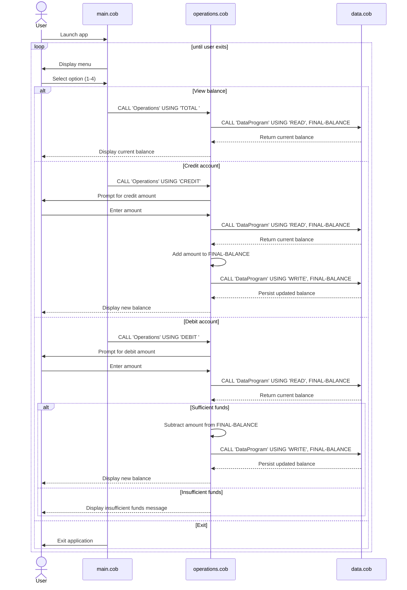

# Student Account COBOL Reference

This project demonstrates a small account-management system written in COBOL. It models a student account with a current balance, support for viewing the balance, making deposits (credits), and processing withdrawals (debits).

## Overview

The program is organized into three COBOL programs:

- `main.cob` provides the user menu and program flow.
- `operations.cob` performs the account actions.
- `data.cob` stores and retrieves the persisted account balance.

## File Purpose and Key Functions

### 1. `src/cobol/main.cob`

Purpose:
- Entry point for the application.
- Displays the menu and routes user choices to the account operations.

Key functions:
- Displays a simple account management menu:
  - View Balance
  - Credit Account
  - Debit Account
  - Exit
- Accepts a numeric choice from the user.
- Uses `EVALUATE` to dispatch the selected action.
- Calls `Operations` with the operation code:
  - `TOTAL ` for balance inquiry
  - `CREDIT` for deposit
  - `DEBIT ` for withdrawal
- Continues until the user selects Exit.

Behavior:
- The program loops until the user enters `4` or chooses to exit.
- Invalid menu selections show an error and re-display the menu.

### 2. `src/cobol/operations.cob`

Purpose:
- Implements the business actions associated with student account transactions.
- Bridges the user-facing menu with the stored account data.

Key functions:
- Reads the operation type from the passed string.
- Handles three transaction types:
  - `TOTAL `: retrieves and displays the current balance.
  - `CREDIT`: prompts for an amount, reads the current balance, adds the credit, updates the stored value, and displays the new total.
  - `DEBIT `: prompts for an amount, reads the current balance, validates whether funds are available, subtracts the amount, writes the updated balance, and displays the result.
- Calls `DataProgram` with `READ` and `WRITE` operations to access the account balance.

Business rules:
- A student account starts with a balance of `1000.00`.
- Credits always increase the account balance.
- Withdrawals are allowed only when the current balance is greater than or equal to the debit amount.
- If a debit exceeds the available balance, the program displays: `Insufficient funds for this debit.` and does not update the balance.

### 3. `src/cobol/data.cob`

Purpose:
- Represents the underlying data layer for the student account balance.
- Stores the current balance between operations.

Key functions:
- Maintains a working storage balance initialized to `1000.00`.
- Accepts a passed operation code and balance value via the `PROCEDURE DIVISION USING` clause.
- Supports two data operations:
  - `READ`: returns the current stored balance.
  - `WRITE`: updates the stored balance with the new value.

Business rules and assumptions:
- The balance is stored as a numeric field using `PIC 9(6)V99`, which supports values up to `999999.99` with two decimal places.
- The data program acts as a simple persistence layer for this sample application; it does not enforce complex account policies beyond the current balance value.

## Business Rules for Student Accounts

The sample business logic reflects a simple student checking-style account model:

1. Initial balance is `1000.00`.
2. A student can check the current balance at any time.
3. A credit increases the balance by the entered amount.
4. A debit subtracts the amount only if sufficient balance exists.
5. Overdrafts are prevented; the system rejects debit requests that would make the balance negative.
6. Balance values are maintained in decimal format with cents precision.

## Example Workflow

A typical interaction looks like this:

- User chooses `1` to view the balance.
- User chooses `2` to credit the account, for example by entering `250.00`.
- User chooses `3` to debit the account, for example by entering `75.50`.
- If the requested debit is greater than the available balance, the transaction is denied.

## Summary

This COBOL sample is intentionally small and educational. It demonstrates core programming concepts in COBOL such as:

- menu-driven user interfaces,
- modular program calls,
- data passing between programs,
- balance validation logic,
- basic financial rules for a student account.

## Sequence Diagram

